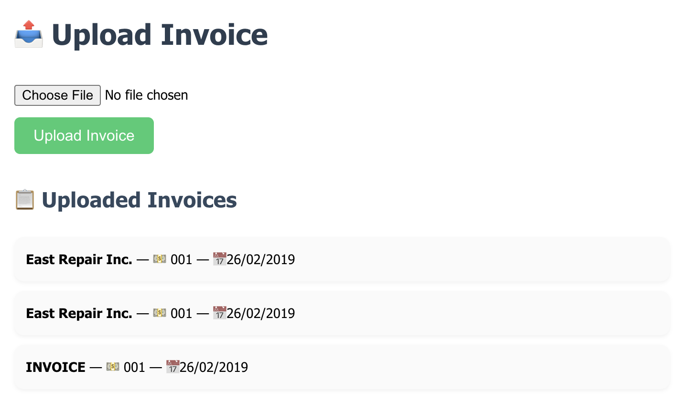
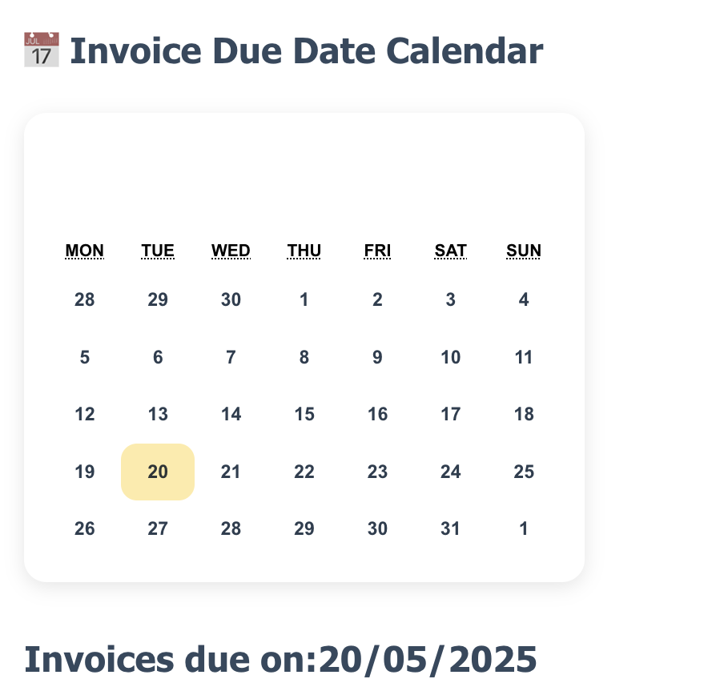
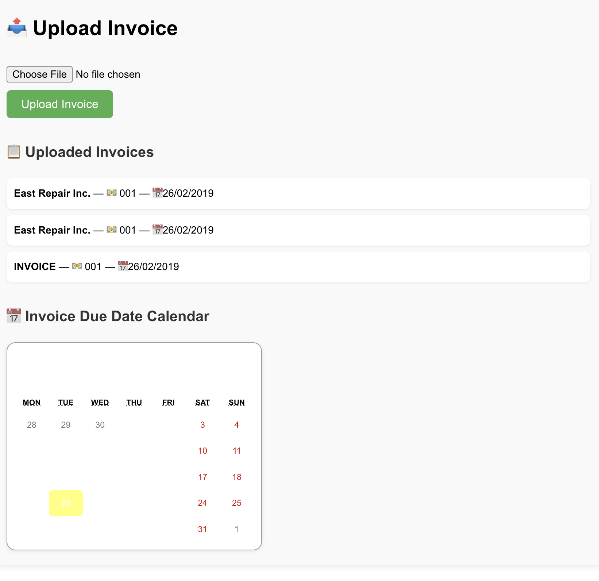

# 📄 Invoice Scanner + Payment Tracker

A full-stack app that allows users to upload invoices (image or PDF), 
extract key data (vendor, amount, due date) using OCR and NLP, track them 
on a calendar, and get email reminders before due dates.

---

## 🚀 Features

- 📤 Upload invoice (image/PDF)
- 🔍 OCR via Tesseract
- 🧠 NLP to extract invoice fields
- 📅 Visual calendar to show due dates
- 📬 Email reminders for upcoming invoices
- 💾 MongoDB for storage

---

## 🛠 Tech Stack

| Layer      | Tech                    |
|------------|-------------------------|
| Frontend   | React.js, CSS           |
| Backend    | Flask (Python)          |
| OCR/NLP    | pytesseract, re         |
| Database   | MongoDB                 |
| Email      | Gmail SMTP              |

---

## 📸 Screenshots

### Invoice Upload + Result


### Calendar View


### Full App Screenshot


---

## 🧪 How to Run the App (Backend + Frontend + Email)

```bash
# 👉 Run Flask Backend
cd backend
source venv/bin/activate
python app.py

# 👉 Run React Frontend
cd ../frontend
npm install
npm start

# 👉 Setup Email Reminders (edit this file with your Gmail credentials)
nano ../backend/send_reminders.py

# Inside send_reminders.py, set:
# EMAIL_USER = "your_email@gmail.com"
# EMAIL_PASS = "your_app_password"

